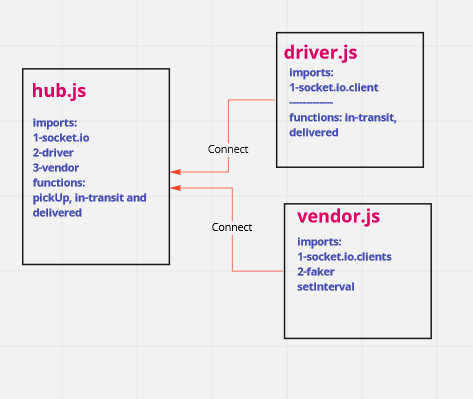

# caps-refactor

This is a refactor code for the [caps](https://github.com/salammustafa728/caps) repo that uses an event deiven to fire events, and this repo use the socket.io to fire events between the driver app and the vendor app.

**Caps:** Is an application for a product called CAPS, and it simulate a delivery service where vendors (such a flower shops) will ship products using the delivery service and when the drivers deliver them, each vendor will be notified that their customers received what they purchased.

* [PR link]()

* [action link]()

* [heroku link]()

# UML 

